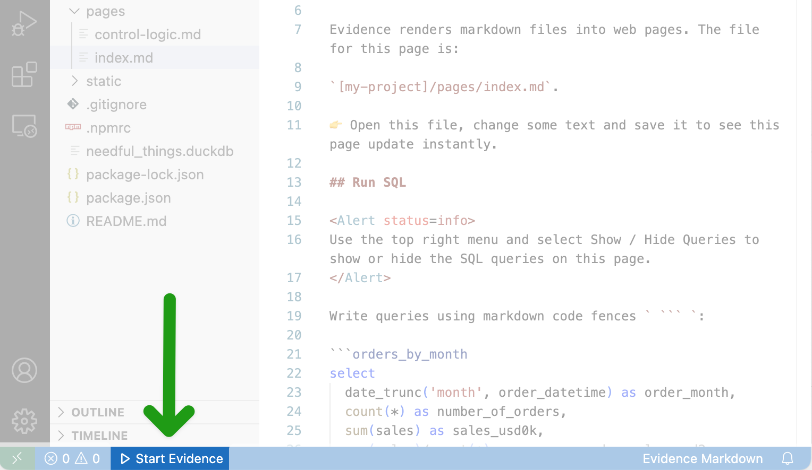

# Start Your App

Use the button at the bottom left of your VS Code window to start or stop your Evidence app.

You can also use the `Cmd + R` shortcut (`Ctrl + R` on Windows).

## Live Preview
Running your app will open a side-by-side live preview in your window. Make changes in your code and save them to see them appear instantly in the preview.

## Preview Options
You can change your preferred preview method from within the VS Code Settings menu. The available options are:
- VS Code default browser
   - Side-by-side
   - Full width
- Open external web browser
- None